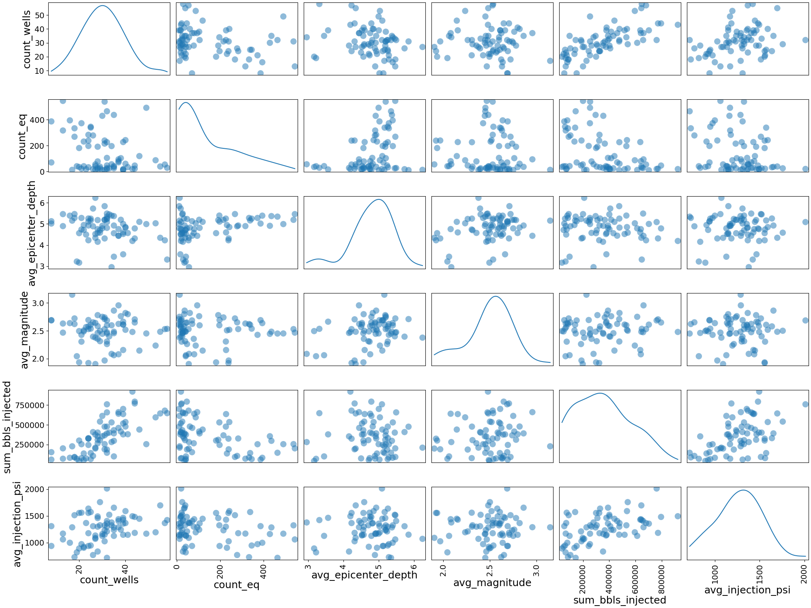

# Shaking Oklahoma: Induced Earthquake Prediction
## Table of Contents
1. [Introduction](#Introduction)
2. [Raw Data](#Raw_data)
3. [EDA](#EDA)
4. [Analysis](#Analysis)
5. [Discussion](#Discussion)
6. [Future Work](#Future_Work)
7. [Refrences](#Refrences)

# Introduction

**Is it possible to predict the number of induced earthquakes that will occur in Oklahoma each month based on the number of salt water disposal wells, the cumlative barrels injected, and the rate of injection?**

Injection-induced earthquakes are a man-made problem that has become an important environmental and political issue. These earthquakes are produced when fluid injected into salt water disposal wells reactivates a subsurface fault. The elevated fluid pressure can weaken preexisting faults causing the fault to “slip”. In general, wells that dispose of large volumes of waste water and/ or dispose in areas that communicate with basement faults have a higher probability of inducing seismicity (Ellsworth, 2013, pg. 142). 

 Earthquakes in Oklahoma from pre-1970 to 2016: Maps by Anna Stafford

  

Below is a helful video explaining how injection from a salt water disposal well may induce an earthquake. 

 NPR StateImpact: How Disposal Wells Might Cause Earthquakes

  

# Raw Data
The data set includes a csv file with injection well information provided by oil and gas companies and a csv file of earthquakes in Oklahoma sourced from Kaggle.com. 

<table style="border-collapse:collapse;border-spacing:0" class="tg"><tr><th style="font-family:Arial, sans-serif;font-size:14px;font-weight:normal;padding:10px 5px;border-style:solid;border-width:1px;overflow:hidden;word-break:normal;border-color:inherit;text-align:left;vertical-align:top">Earthquake Data Columns</th><th style="font-family:Arial, sans-serif;font-size:14px;font-weight:normal;padding:10px 5px;border-style:solid;border-width:1px;overflow:hidden;word-break:normal;border-color:inherit;text-align:left;vertical-align:top">Injection Well Data</th></tr><tr><td style="font-family:Arial, sans-serif;font-size:14px;padding:10px 5px;border-style:solid;border-width:1px;overflow:hidden;word-break:normal;border-color:inherit;text-align:left;vertical-align:top">11630 Rows</td><td style="font-family:Arial, sans-serif;font-size:14px;padding:10px 5px;border-style:solid;border-width:1px;overflow:hidden;word-break:normal;border-color:inherit;text-align:left;vertical-align:top">8512 Rows</td></tr><tr><td style="font-family:Arial, sans-serif;font-size:14px;padding:10px 5px;border-style:solid;border-width:1px;overflow:hidden;word-break:normal;border-color:inherit;text-align:left;vertical-align:top">time</td><td style="font-family:Arial, sans-serif;font-size:14px;padding:10px 5px;border-style:solid;border-width:1px;overflow:hidden;word-break:normal;border-color:inherit;text-align:left;vertical-align:top">API#</td></tr><tr><td style="font-family:Arial, sans-serif;font-size:14px;padding:10px 5px;border-style:solid;border-width:1px;overflow:hidden;word-break:normal;border-color:inherit;text-align:left;vertical-align:top">latitude</td><td style="font-family:Arial, sans-serif;font-size:14px;padding:10px 5px;border-style:solid;border-width:1px;overflow:hidden;word-break:normal;border-color:inherit;text-align:left;vertical-align:top">Operator</td></tr><tr><td style="font-family:Arial, sans-serif;font-size:14px;padding:10px 5px;border-style:solid;border-width:1px;overflow:hidden;word-break:normal;border-color:inherit;text-align:left;vertical-align:top">longitude</td><td style="font-family:Arial, sans-serif;font-size:14px;padding:10px 5px;border-style:solid;border-width:1px;overflow:hidden;word-break:normal;border-color:inherit;text-align:left;vertical-align:top">Operator ID</td></tr><tr><td style="font-family:Arial, sans-serif;font-size:14px;padding:10px 5px;border-style:solid;border-width:1px;overflow:hidden;word-break:normal;border-color:inherit;text-align:left;vertical-align:top">depth</td><td style="font-family:Arial, sans-serif;font-size:14px;padding:10px 5px;border-style:solid;border-width:1px;overflow:hidden;word-break:normal;border-color:inherit;text-align:left;vertical-align:top">WellType</td></tr><tr><td style="font-family:Arial, sans-serif;font-size:14px;padding:10px 5px;border-style:solid;border-width:1px;overflow:hidden;word-break:normal;border-color:inherit;text-align:left;vertical-align:top">mag</td><td style="font-family:Arial, sans-serif;font-size:14px;padding:10px 5px;border-style:solid;border-width:1px;overflow:hidden;word-break:normal;border-color:inherit;text-align:left;vertical-align:top">WellName</td></tr><tr><td style="font-family:Arial, sans-serif;font-size:14px;padding:10px 5px;border-style:solid;border-width:1px;overflow:hidden;word-break:normal;border-color:inherit;text-align:left;vertical-align:top">magType</td><td style="font-family:Arial, sans-serif;font-size:14px;padding:10px 5px;border-style:solid;border-width:1px;overflow:hidden;word-break:normal;border-color:inherit;text-align:left;vertical-align:top">WellNumber</td></tr><tr><td style="font-family:Arial, sans-serif;font-size:14px;padding:10px 5px;border-style:solid;border-width:1px;overflow:hidden;word-break:normal;border-color:inherit;text-align:left;vertical-align:top">nst</td><td style="font-family:Arial, sans-serif;font-size:14px;padding:10px 5px;border-style:solid;border-width:1px;overflow:hidden;word-break:normal;border-color:inherit;text-align:left;vertical-align:top">OrderNumbers</td></tr><tr><td style="font-family:Arial, sans-serif;font-size:14px;padding:10px 5px;border-style:solid;border-width:1px;overflow:hidden;word-break:normal;border-color:inherit;text-align:left;vertical-align:top">gap</td><td style="font-family:Arial, sans-serif;font-size:14px;padding:10px 5px;border-style:solid;border-width:1px;overflow:hidden;word-break:normal;border-color:inherit;text-align:left;vertical-align:top">Approval Date</td></tr><tr><td style="font-family:Arial, sans-serif;font-size:14px;padding:10px 5px;border-style:solid;border-width:1px;overflow:hidden;word-break:normal;border-color:inherit;text-align:left;vertical-align:top">dmin</td><td style="font-family:Arial, sans-serif;font-size:14px;padding:10px 5px;border-style:solid;border-width:1px;overflow:hidden;word-break:normal;border-color:inherit;text-align:left;vertical-align:top">County</td></tr><tr><td style="font-family:Arial, sans-serif;font-size:14px;padding:10px 5px;border-style:solid;border-width:1px;overflow:hidden;word-break:normal;border-color:inherit;text-align:left;vertical-align:top">rms</td><td style="font-family:Arial, sans-serif;font-size:14px;padding:10px 5px;border-style:solid;border-width:1px;overflow:hidden;word-break:normal;border-color:inherit;text-align:left;vertical-align:top">Sec</td></tr><tr><td style="font-family:Arial, sans-serif;font-size:14px;padding:10px 5px;border-style:solid;border-width:1px;overflow:hidden;word-break:normal;border-color:inherit;text-align:left;vertical-align:top">net</td><td style="font-family:Arial, sans-serif;font-size:14px;padding:10px 5px;border-style:solid;border-width:1px;overflow:hidden;word-break:normal;border-color:inherit;text-align:left;vertical-align:top">Twp</td></tr><tr><td style="font-family:Arial, sans-serif;font-size:14px;padding:10px 5px;border-style:solid;border-width:1px;overflow:hidden;word-break:normal;border-color:inherit;text-align:left;vertical-align:top">id</td><td style="font-family:Arial, sans-serif;font-size:14px;padding:10px 5px;border-style:solid;border-width:1px;overflow:hidden;word-break:normal;border-color:inherit;text-align:left;vertical-align:top">Rng</td></tr><tr><td style="font-family:Arial, sans-serif;font-size:14px;padding:10px 5px;border-style:solid;border-width:1px;overflow:hidden;word-break:normal;border-color:inherit;text-align:left;vertical-align:top">updated</td><td style="font-family:Arial, sans-serif;font-size:14px;padding:10px 5px;border-style:solid;border-width:1px;overflow:hidden;word-break:normal;border-color:inherit;text-align:left;vertical-align:top">QQQQ</td></tr><tr><td style="font-family:Arial, sans-serif;font-size:14px;padding:10px 5px;border-style:solid;border-width:1px;overflow:hidden;word-break:normal;border-color:inherit;text-align:left;vertical-align:top">place</td><td style="font-family:Arial, sans-serif;font-size:14px;padding:10px 5px;border-style:solid;border-width:1px;overflow:hidden;word-break:normal;border-color:inherit;text-align:left;vertical-align:top">LAT</td></tr><tr><td style="font-family:Arial, sans-serif;font-size:14px;padding:10px 5px;border-style:solid;border-width:1px;overflow:hidden;word-break:normal;border-color:inherit;text-align:left;vertical-align:top">type</td><td style="font-family:Arial, sans-serif;font-size:14px;padding:10px 5px;border-style:solid;border-width:1px;overflow:hidden;word-break:normal;border-color:inherit;text-align:left;vertical-align:top">LONG</td></tr><tr><td style="font-family:Arial, sans-serif;font-size:14px;padding:10px 5px;border-style:solid;border-width:1px;overflow:hidden;word-break:normal;border-color:inherit;text-align:left;vertical-align:top">horizontalError</td><td style="font-family:Arial, sans-serif;font-size:14px;padding:10px 5px;border-style:solid;border-width:1px;overflow:hidden;word-break:normal;border-color:inherit;text-align:left;vertical-align:top">PSI</td></tr><tr><td style="font-family:Arial, sans-serif;font-size:14px;padding:10px 5px;border-style:solid;border-width:1px;overflow:hidden;word-break:normal;border-color:inherit;text-align:left;vertical-align:top">depthError</td><td style="font-family:Arial, sans-serif;font-size:14px;padding:10px 5px;border-style:solid;border-width:1px;overflow:hidden;word-break:normal;border-color:inherit;text-align:left;vertical-align:top">BBLS</td></tr><tr><td style="font-family:Arial, sans-serif;font-size:14px;padding:10px 5px;border-style:solid;border-width:1px;overflow:hidden;word-break:normal;border-color:inherit;text-align:left;vertical-align:top">magError</td><td style="font-family:Arial, sans-serif;font-size:14px;padding:10px 5px;border-style:solid;border-width:1px;overflow:hidden;word-break:normal;border-color:inherit;text-align:left;vertical-align:top">ZONE</td></tr><tr><td style="font-family:Arial, sans-serif;font-size:14px;padding:10px 5px;border-style:solid;border-width:1px;overflow:hidden;word-break:normal;border-color:inherit;text-align:left;vertical-align:top">magNst</td><td style="font-family:Arial, sans-serif;font-size:14px;padding:10px 5px;border-style:solid;border-width:1px;overflow:hidden;word-break:normal;border-color:inherit;text-align:left;vertical-align:top"></td></tr><tr><td style="font-family:Arial, sans-serif;font-size:14px;padding:10px 5px;border-style:solid;border-width:1px;overflow:hidden;word-break:normal;border-color:inherit;text-align:left;vertical-align:top">status</td><td style="font-family:Arial, sans-serif;font-size:14px;padding:10px 5px;border-style:solid;border-width:1px;overflow:hidden;word-break:normal;border-color:inherit;text-align:left;vertical-align:top"></td></tr><tr><td style="font-family:Arial, sans-serif;font-size:14px;padding:10px 5px;border-style:solid;border-width:1px;overflow:hidden;word-break:normal;border-color:inherit;text-align:left;vertical-align:top">locationSource</td><td style="font-family:Arial, sans-serif;font-size:14px;padding:10px 5px;border-style:solid;border-width:1px;overflow:hidden;word-break:normal;border-color:inherit;text-align:left;vertical-align:top"></td></tr><tr><td style="font-family:Arial, sans-serif;font-size:14px;padding:10px 5px;border-style:solid;border-width:1px;overflow:hidden;word-break:normal;border-color:inherit;text-align:left;vertical-align:top">magSource</td><td style="font-family:Arial, sans-serif;font-size:14px;padding:10px 5px;border-style:solid;border-width:1px;overflow:hidden;word-break:normal;border-color:inherit;text-align:left;vertical-align:top"></td></tr></table>

# EDA 

  

 Earthquakes Pre 2010

  

 Earthquakes Post 2010

  

# Analysis

## Cleaning Pipeline

  

## Modeling

* Data was split based on year into train/ test subsets
* The training set features included monthly well count, barrels injected, and average psi from 1973- December of 2014 (predicting monthly earthquakes for the same date range)
* The test set was limited to data the 12 months in 2015

  

* The number of barrels injected each month is the most significant value in predicing the number of montly earthquakes

<table style="border-collapse:collapse;border-spacing:0;margin:0px auto" class="tg"><tr><th style="font-family:Arial, sans-serif;font-size:14px;font-weight:normal;padding:10px 5px;border-style:solid;border-width:1px;overflow:hidden;word-break:normal;border-color:inherit;background-color:#c0c0c0;text-align:left;vertical-align:middle">Random Forest Regressor</th><th style="font-family:Arial, sans-serif;font-size:14px;font-weight:normal;padding:10px 5px;border-style:solid;border-width:1px;overflow:hidden;word-break:normal;border-color:inherit;background-color:#c0c0c0;text-align:left;vertical-align:top">n_estimators = 100</th></tr><tr><td style="font-family:Arial, sans-serif;font-size:14px;padding:10px 5px;border-style:solid;border-width:1px;overflow:hidden;word-break:normal;border-color:inherit;text-align:left;vertical-align:top">Mean Absolute Error</td><td style="font-family:Arial, sans-serif;font-size:14px;padding:10px 5px;border-style:solid;border-width:1px;overflow:hidden;word-break:normal;border-color:inherit;text-align:left;vertical-align:top">335.70</td></tr><tr><td style="font-family:Arial, sans-serif;font-size:14px;padding:10px 5px;border-style:solid;border-width:1px;overflow:hidden;word-break:normal;border-color:inherit;text-align:left;vertical-align:top">Mean Squared Error</td><td style="font-family:Arial, sans-serif;font-size:14px;padding:10px 5px;border-style:solid;border-width:1px;overflow:hidden;word-break:normal;border-color:inherit;text-align:left;vertical-align:top">125951.51</td></tr><tr><td style="font-family:Arial, sans-serif;font-size:14px;padding:10px 5px;border-style:solid;border-width:1px;overflow:hidden;word-break:normal;border-color:inherit;text-align:left;vertical-align:top">Root Mean Squared Error</td><td style="font-family:Arial, sans-serif;font-size:14px;padding:10px 5px;border-style:solid;border-width:1px;overflow:hidden;word-break:normal;border-color:inherit;text-align:left;vertical-align:top">354.90</td></tr></table>

* The RMSE for the random forest regressor is very high
* This is most likely due to training the model with such a wide date range

  

 Residual vs. y_predict

# Discussion 

* Neither model performed well
* Improvement should be made by increasing the number of training features and by limiting the date range to highlight the drastic increase in earthquakes from 2010 to 2015 
* Additional features to include:
    * 12 month previous epicenter depth and magnitude data 
    * Well proximity to earthquake (lat/long)
    * Injection formation 

  

* The underlying flaw in the current project is the lack of relational distance between well locations and earthquake occurance
* The biggest hurdle for any future work will be to create a radius around each earthquake epicenter and only use the wells located within that radius to predict future earthquakes

 Earthquakes(red) vs Injection Wells (blue): Map by Anna Stafford

  

## Future Work 

* Incorporate data from 2015 - 2018 as hold out data for new models
* Train models using only significant date ranges
* Create more features 
* Calculate well data within local earthquake radius 

## Refrences 

W. L. Ellsworth,Science 341, 1225942 (2013).
  DOI: 10.1126/science.1225942