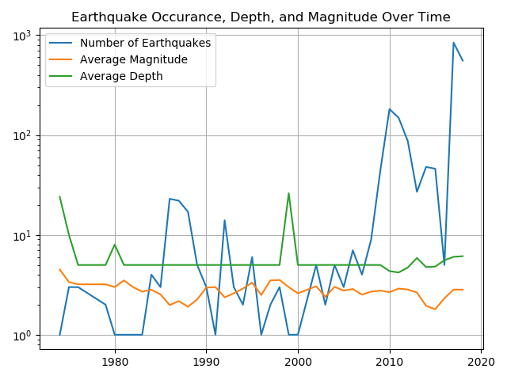
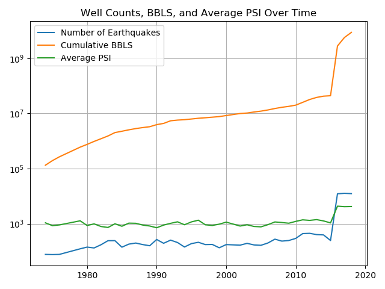
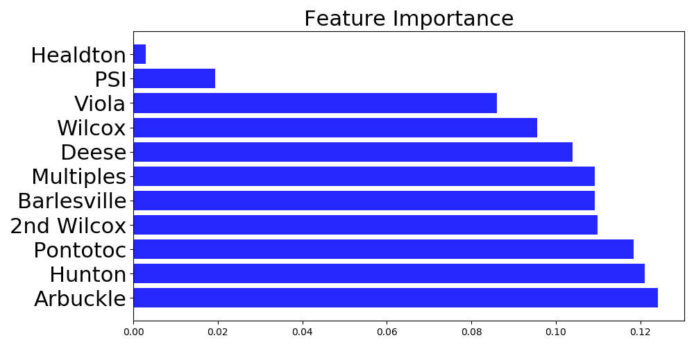

# Shaking Oklahoma: Induced Earthquake Prediction
## Table of Contents
1. [Introduction](#Introduction)
2. [Raw Data](#Raw_data)
3. [EDA](#EDA)
4. [Analysis](#Analysis)
5. [Discussion](#Discussion)
6. [Future Work](#Future_Work)
7. [Refrences](#Refrences)

# Introduction

Injection-induced earthquakes are a man-made problem that has become an important environmental and political issue. These earthquakes are produced when fluid injected into salt water disposal wells reactivates a subsurface fault. The elevated fluid pressure can weaken pre-existing faults causing the fault to “slip.” In general, wells that dispose of large volumes of wastewater and/or dispose in areas that communicate with basement faults have a higher probability of inducing seismicity (Ellsworth, 2013, pg. 142). 
The primary objective was to use the cumulative sum of waste water injected into individual formations in the Oklahoma subsurface to predict the number of yearly earthquakes.

 Earthquakes in Oklahoma from pre-1970 to 2016: Maps by Anna Stafford

  

Below is a helful video explaining how injection from a salt water disposal well may induce an earthquake. 

 NPR StateImpact: How Disposal Wells Might Cause Earthquakes

  

# Raw Data
The data for this analysis was sourced from Kaggle, the USGS, and the OK Oil and Gas Commission. The Kaggle data covers 1973 – 2015, with the other sources covering 2016 – 2018. The data includes individual injection well history and each earthquake occurrence. 

  

# EDA 

  

  

# Analysis

## Project Pipeline

  

## Modeling

Two models were created for this analysis. The first model included only the total barrels injected each year and the average PSI at injection.The second model breaks out the individual formations in order to analyze the major contributing formations. Both models show that injected barrels are the most significant feature contributing to the prediction of earthquakes. 

  

  

  

  

# Discussion 

Formatting geologic data into a workable dataframe for machine learning while maintaining the integrity and interpretation of the data is a complicated process. The Random Forest Regression model was the best option for this data set due to the non-linear relationship between injected barrels of wastewater and earthquake occurrence. The first of the two models used only the total cumulative barrels injected and the average PSI per year, the second model included the cumulative injected barrels broken out by individual formation. While both models yielded similar results, the second provides more granularity. The Arbuckle, Hunton, and Pontotoc formations are the three most contributing formations in the model. This suggests that companies should limit future injection into these formations. Further research should include a detailed analysis of the geologic properties for each formation, the relationship to the earthquake epicenters,  the location of the wells, and the surrounding basement faults.

 Earthquakes(red) vs Injection Wells (blue) in Oklahoma: Map by Anna Stafford

  

## Refrences 

1. W. L. Ellsworth,Science 341, 1225942 (2013).
  DOI: 10.1126/science.1225942
2. A. Stafford, Map of Oklahoma Injection 
Wells vs. Earthquake Epicenters
3. Stack Overflow